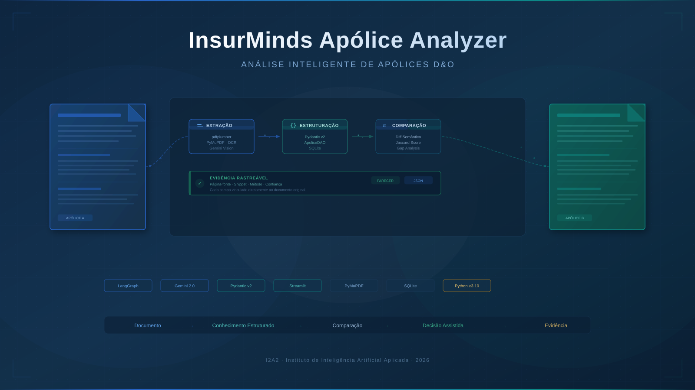
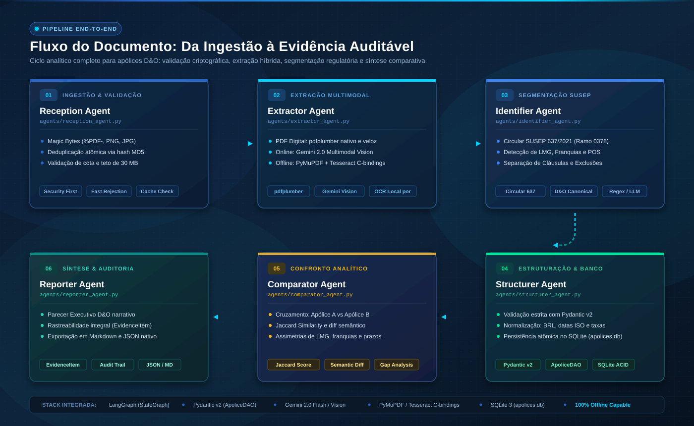
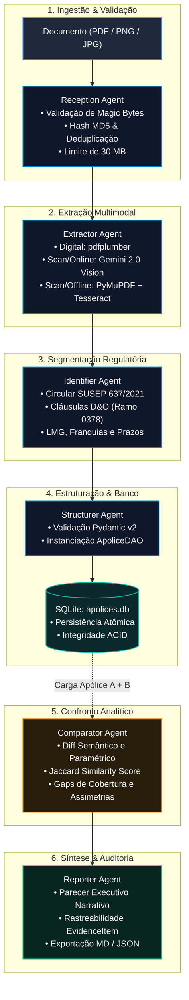
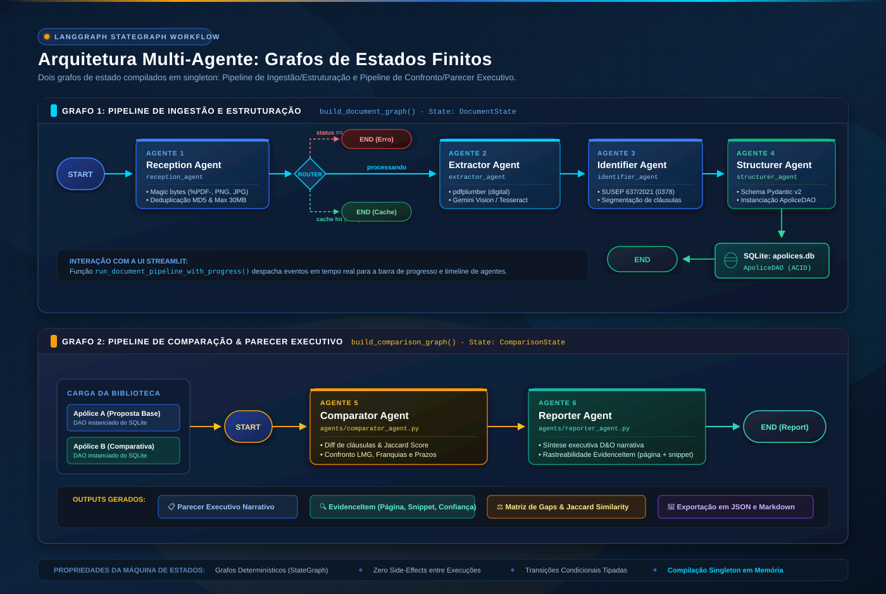
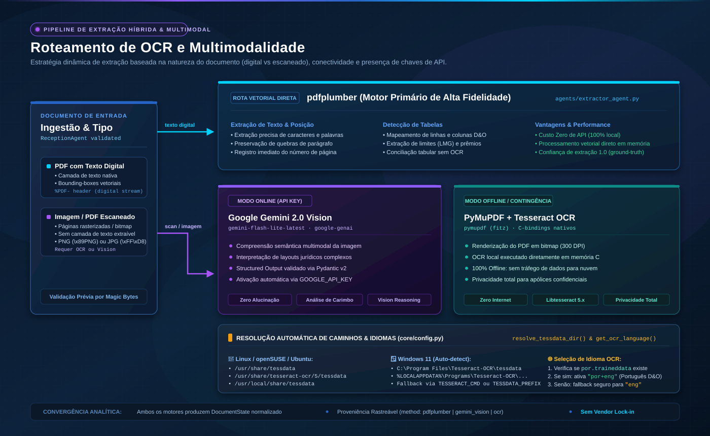
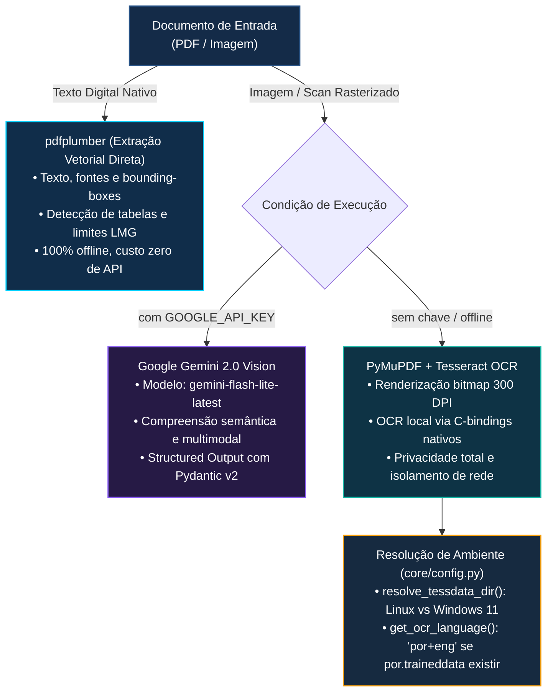

# InsurMinds Apólice Analyzer

**Plataforma de Análise e Comparação Assistida de Apólices D&O**
_Trabalho de Conclusão de Curso · I2A2 — Instituto de Inteligência Artificial Aplicada (2026)_

[](https://www.python.org/downloads/)
[](https://github.com/langchain-ai/langgraph)
[](https://streamlit.io/)
[](https://ai.google.dev/)
[](tests/)
[](docs/testing/CROSS_PLATFORM_MATRIX.md)
[](docs/testing/CROSS_PLATFORM_MATRIX.md)
[](LICENSE)

<p align="center">
  
</p>

---

## 📋 Metadados do Projeto

**Projeto:** Desafio Final — Plataforma Inteligente para Análise e Comparação de Apólices D&O
**Equipe:** Seguros Connect
**Data:** 30/09/2026
**Status do Projeto:** MVP Concluído & Homologado — **182/182 Testes Aprovados (100% Pass)**

### 👥 Integrantes

- **Edcarlos Cardôso de Farias**
- **Eric Narciso Pimentel dos Santos**

### 🎯 Nossa Solução

O **InsurMinds Apólice Analyzer** é uma solução inteligente para **análise e comparação assistida de apólices D&O**. A plataforma recebe documentos em PDF e imagens, realiza a extração estruturada das informações contratuais, utiliza Inteligência Artificial Generativa e processamento multimodal quando disponível, e organiza os dados para permitir a comparação entre diferentes documentos.

A solução identifica diferenças relevantes entre as apólices, relaciona cada achado às suas **evidências documentais — página, trecho, seção e método de extração —** e apresenta os resultados de forma estruturada para apoiar a análise de profissionais de seguros, subscrição, corretagem e jurídico.

O princípio central da solução é:

> **Documento → Conhecimento Estruturado → Comparação → Decisão Assistida → Evidência**

A plataforma foi concebida como uma ferramenta de **apoio à análise contratual**, mantendo a avaliação profissional e a decisão final sob responsabilidade humana.

**I2A2 · Desafio Final · Entrega Oficial**

---

## 📌 1. O Problema

Apólices de seguro **D&O (Directors & Officers)** são contratos corporativos extensos — tipicamente entre 30 e 80 páginas — redigidas em linguagem jurídica e financeira densa. Comparar propostas concorrentes de diferentes seguradoras exige horas de trabalho especializado de corretores, advogados e membros de conselhos de administração.

O processo manual é lento, sujeito a erros de omissão e oferece rastreabilidade documental limitada, tornando difícil fundamentar decisões contratuais com evidências precisas extraídas dos próprios documentos.

---

## 💡 2. A Solução

O **InsurMinds Apólice Analyzer** é uma ferramenta de **análise e comparação assistida** de apólices D&O. O sistema automatiza o ciclo completo de ingestão, extração, estruturação e confronto analítico, entregando ao analista humano um parecer técnico fundamentado em evidências extraídas diretamente dos contratos.

> **⚠️ Aviso de Uso Profissional:** Esta ferramenta tem caráter auxiliar e não substitui a avaliação jurídica ou técnica de um profissional habilitado. Toda decisão de contratação deve ser tomada com assessoria especializada. O sistema apresenta análises comparativas e evidências documentais — a decisão final permanece integralmente com o profissional responsável.

---

## ✅ 3. Funcionalidades do MVP

| #   | Funcionalidade                    | Descrição                                                                                                              |
| --- | --------------------------------- | ---------------------------------------------------------------------------------------------------------------------- |
| 1   | **Ingestão & Validação**          | Verificação por magic bytes (`%PDF-`, `\x89PNG`, `\xFF\xD8\xFF`), integridade e deduplicação idempotente por hash MD5. |
| 2   | **Extração Híbrida**              | Extração de texto digital via`pdfplumber` (PDFs) e rotas Vision/OCR para documentos escaneados e imagens.              |
| 3   | **Estruturação Canônica**         | Conversão em esquemas tipados via Pydantic v2 (`ApoliceDAO`) com validação estrita de campos regulatórios.             |
| 4   | **Armazenamento Relacional**      | Persistência em SQLite (`apolices.db`) com transações seguras e migração automática de schema.                         |
| 5   | **Comparação Analítica**          | Motor determinístico de diff de cláusulas com Índice de Similaridade Composto (Jaccard ponderado).                     |
| 6   | **Parecer Executivo**             | Síntese narrativa técnica com rastreabilidade de evidências — gerada por IA com fallback determinístico.               |
| 7   | **Auditoria Contábil**            | Variação de sinistros e conciliação PSL com identificação de maiores ofensores (conformidade SUSEP).                   |
| 8   | **Rastreabilidade de Evidências** | Toda inferência é acompanhada de página-fonte, snippet do documento e grau de confiança.                               |

**Formatos de Entrada Suportados:** PDF (digital e escaneado), PNG, JPG e JPEG.

---

## 🔄 4. Fluxo do Documento

<p align="center">
  
</p>

<details>
<summary><b>📐 Ver especificação técnica e diagrama Mermaid do fluxo</b></summary>



</details>

---

## 🏗️ 5. Arquitetura Multi-Agente (LangGraph)

O fluxo é orquestrado por um **grafo de estados finitos** composto por **6 agentes especializados**, implementado com LangGraph:

<p align="center">
  
</p>

<details>
<summary><b>📐 Ver máquina de estados e diagrama Mermaid da arquitetura</b></summary>

```mermaid
stateDiagram-v2
    classDef default fill:#0E1B2E,stroke:#1E3E66,stroke-width:1.5px,color:#CADDF2
    classDef agent fill:#132F52,stroke:#00D2FF,stroke-width:1.5px,color:#FFFFFF
    classDef error fill:#451A1A,stroke:#EF4444,stroke-width:1.5px,color:#FCA5A5
    classDef cache fill:#1A3A35,stroke:#10B981,stroke-width:1.5px,color:#6EE7B7
    classDef comp fill:#2D2816,stroke:#F59E0B,stroke-width:1.5px,color:#FFFFFF
    classDef report fill:#113E3B,stroke:#14B8A6,stroke-width:1.5px,color:#FFFFFF

    state "Pipeline de Ingestão & Estruturação (DocumentState)" as PipelineIngestao {
        [*] --> ReceptionAgent

        state Router <<choice>>
        ReceptionAgent --> Router

        Router --> ExtractorAgent: Status == "processando"
        Router --> CacheHit: Cache hit (MD5 existente)
        Router --> ValidationError: Erro de formato / magic bytes

        CacheHit --> [*]
        ValidationError --> [*]

        ExtractorAgent --> IdentifierAgent: Texto digital / OCR extraído
        IdentifierAgent --> StructurerAgent: Cláusulas e campos segmentados

        state "StructurerAgent & SQLite (apolices.db)" as StructurerAgent
        StructurerAgent --> [*]: ApoliceDAO persistido
    }

    state "Pipeline de Comparação & Parecer (ComparisonState)" as PipelineComparacao {
        [*] --> ComparatorAgent: Carregamento Apólice A + Apólice B
        ComparatorAgent --> ReporterAgent: Diff de cláusulas + Jaccard Score
        ReporterAgent --> [*]: Parecer Executivo + EvidenceItems (JSON / MD)
    }
```

</details>

### Agentes e Componentes

| Agente                  | Arquivo                      | Responsabilidade                                                                                      |
| ----------------------- | ---------------------------- | ----------------------------------------------------------------------------------------------------- |
| **1. Reception Agent**  | `agents/reception_agent.py`  | Validação de segurança (magic bytes), limite de tamanho, extensão e deduplicação por MD5.             |
| **2. Extractor Agent**  | `agents/extractor_agent.py`  | Extração de texto digital (`pdfplumber`) e rota OCR/Vision para imagens e PDFs escaneados.            |
| **3. Identifier Agent** | `agents/identifier_agent.py` | Segmentação das cláusulas D&O e mapeamento de campos ao schema canônico regulatório.                  |
| **4. Structurer Agent** | `agents/structurer_agent.py` | Instanciação do`ApoliceDAO` (Pydantic v2) e persistência atômica no banco SQLite.                     |
| **5. Comparator Agent** | `agents/comparator_agent.py` | Confronto analítico entre duas apólices: diff de cláusulas, Jaccard Score e divergências financeiras. |
| **6. Reporter Agent**   | `agents/reporter_agent.py`   | Síntese do parecer executivo narrativo com rastreabilidade de evidências (`EvidenceItem`).            |

---

## 🤖 6. Inteligência Artificial e Fallback Determinístico

O sistema opera em dois modos transparentes e complementares:

### Modo IA Generativa (com `GOOGLE_API_KEY`)

- Utiliza o SDK oficial `google-genai` com o modelo `gemini-flash-lite-latest`.
- Extração de campos via **Structured Output** validado por Pydantic v2 — sem alucinações de schema.
- Rota Vision para documentos escaneados ou imagens PNG/JPG com análise multimodal.

### Modo de Contingência Determinístico (sem chave Gemini)

- Motor de heurísticas canônicas baseado nas **normas da SUSEP** (Circular nº 637/2021) e regulamentações D&O (Ramo 0378).
- Regras de extração pré-calibradas para os campos obrigatórios de apólices D&O brasileiras.
- **Zero dependência de API externa.** A aplicação inicializa, processa e compara documentos integralmente offline.

> Ambos os modos produzem saída estruturada idêntica. O parecer executivo indica explicitamente o método de extração utilizado em cada campo.

---

## 🔍 7. Evidências e Rastreabilidade

Cada inferência produzida pelo sistema é acompanhada de um `EvidenceItem` contendo:

- **`page`**: Número da página-fonte do documento original.
- **`snippet`**: Trecho textual literal extraído do contrato.
- **`method`**: Motor utilizado (`pdfplumber`, `llm`, `heuristic`, `ocr`).
- **`confidence`**: Grau de confiança da extração (escala 0.0–1.0).

Isso garante que cada campo do parecer executivo seja auditável e rastreável até o documento original.

---

## 📷 8. OCR e Multimodalidade

<p align="center">
  
</p>

<details>
<summary><b>📐 Ver especificação técnica e diagrama Mermaid de OCR e Multimodalidade</b></summary>



</details>

A detecção do caminho `tessdata` e do idioma OCR (`por+eng` ou `eng`) é feita automaticamente por `resolve_tessdata_dir()` e `get_ocr_language()` em `core/config.py` — sem necessidade de configuração manual.

---

## 🧰 9. Stack Tecnológica

| Camada           | Tecnologia       | Versão Mínima | Papel                                            |
| ---------------- | ---------------- | ------------- | ------------------------------------------------ |
| **Interface**    | Streamlit        | `>=1.39.0`    | UI reativa multipage com timeline de agentes     |
| **Orquestração** | LangGraph        | `>=0.2.0`     | Grafo de estados finita multi-agente             |
| **Schemas**      | Pydantic v2      | `>=2.0.0`     | Contratos de dados e Structured Output           |
| **IA / LLM**     | google-genai     | `>=2.20.0`    | SDK oficial Gemini 2.0 (LLM + Vision)            |
| **PDF Digital**  | pdfplumber       | `>=0.11.0`    | Extração primária de texto em PDFs               |
| **PDF/OCR**      | PyMuPDF          | `>=1.24.0`    | Renderização, conversão e OCR via C-bindings     |
| **Imagens**      | Pillow           | `>=10.0.0`    | Validação de magic bytes e buffers de imagem     |
| **Dados**        | pandas           | `>=2.0.0`     | Dataframes, conciliação contábil (PSL/Sinistros) |
| **Banco**        | sqlite3 (stdlib) | —             | Persistência relacional sem ORM externo          |
| **Config**       | python-dotenv    | `>=1.0.0`     | Carregamento seguro de variáveis de ambiente     |
| **OCR Sistema**  | Tesseract 5.x    | —             | Motor de OCR local (dependência de SO, opcional) |

---

## 📂 10. Estrutura do Repositório

```
InsurMinds_Apolice_Analyzer/
├── .env.example                        # Modelo de variáveis de ambiente (sem segredos)
├── .gitignore                          # Exclusão de .env, .db, .venv e artefatos temporários
├── LICENSE                             # Licença MIT
├── README.md                           # Este arquivo
├── requirements.txt                    # Dependências de runtime (9 pacotes diretos)
├── requirements-dev.txt                # Dependências de testes e QA (herda requirements.txt)
├── app.py                              # Entrada da aplicação Streamlit (multipage)
│
├── agents/                             # Agentes do pipeline LangGraph
│   ├── graph.py                        # Definição do StateGraph e fluxo de execução
│   ├── reception_agent.py              # Agente 1: Validação e deduplicação
│   ├── extractor_agent.py              # Agente 2: Extração híbrida (pdfplumber + OCR/Vision)
│   ├── identifier_agent.py             # Agente 3: Segmentação e mapeamento de cláusulas D&O
│   ├── structurer_agent.py             # Agente 4: Estruturação Pydantic e persistência SQLite
│   ├── comparator_agent.py             # Agente 5: Comparação analítica e Jaccard Score
│   └── reporter_agent.py               # Agente 6: Parecer executivo com evidências
│
├── core/                               # Módulo central de lógica e infraestrutura
│   ├── config.py                       # Configuração cross-platform, OCR e variáveis de ambiente
│   ├── schemas.py                      # Contratos canônicos Pydantic v2 (ApoliceDAO, EvidenceItem)
│   ├── security.py                     # Validação de magic bytes, sanitização e limites de upload
│   ├── database.py                     # DatabaseManager: SQLite + migração DDL automática
│   ├── diff_engine.py                  # Motor de diff determinístico e Score Jaccard ponderado
│   ├── llm_client.py                   # Cliente Gemini 2.0 com Structured Output e fallback
│   └── domain_detector.py              # Detecção de domínio documental (D&O, RC, etc.)
│
├── ui/                                 # Interface de Usuário (Streamlit multipage)
│   ├── styles.py                       # Sistema de design executivo (CSS customizado)
│   ├── tokens.py                       # Design tokens (cores, tipografia, espaçamentos)
│   ├── navigation.py                   # Roteamento de páginas e navegação lateral
│   ├── page_upload.py                  # Tela 1: Ingestão de documentos e timeline dos agentes
│   ├── page_library.py                 # Tela 2: Biblioteca de apólices processadas
│   ├── page_workspace.py               # Tela 3: Workspace de seleção e comparação
│   ├── page_compare.py                 # Tela 4: Matriz comparativa e gap analysis
│   ├── page_detail.py                  # Tela 5: Detalhe completo de apólice com evidências
│   ├── page_report.py                  # Tela 6: Parecer executivo e exportação
│   └── page_accounting.py              # Tela 7: Auditoria Contábil e Variação de Sinistros
│
├── data/                               # Dados do sistema
│   ├── sample_policies/                # Apólices D&O sintéticas de alta fidelidade (ReportLab)
│   ├── generate_samples.py             # Gerador de apólices sintéticas (conformidade SUSEP)
│   └── apolices.db                     # Banco SQLite local (excluído do Git via .gitignore)
│
├── tests/                              # Suíte de testes automatizados (182 testes)
│   ├── test_schemas.py                 # Contratos Pydantic e schemas canônicos
│   ├── test_security.py                # Sanitização, magic bytes e limites de upload
│   ├── test_database.py                # CRUD, migração DDL e idempotência
│   ├── test_diff_engine.py             # Motor analítico de comparação (diff + Jaccard)
│   ├── test_variance_engine.py         # Variância contábil e maiores ofensores
│   ├── test_image_ingestion.py         # Ingestão OCR/Vision de PNG, JPG e JPEG
│   ├── test_fase[2-7]_*.py             # Testes de integração por fase do pipeline
│   └── ...                             # (25 arquivos de teste no total)
│
├── scripts/                            # Scripts de automação e diagnóstico
│   ├── setup_linux.sh                  # Instalação reproduzível no Linux (bash)
│   ├── setup_windows.ps1               # Instalação reproduzível no Windows 11 (PowerShell)
│   └── validate_environment.py         # Diagnóstico cross-platform (PASS/WARNING/BLOCKER)
│
├── docs/                               # Documentação técnica e de produto
│   ├── PRD.md                          # Product Requirements Document
│   ├── testing/                        # Resultados de homologação e contratos de ambiente
│   │   ├── ENVIRONMENT_CONTRACT.md     # Contrato formal de ambiente (Fase 8.0E)
│   │   ├── CROSS_PLATFORM_MATRIX.md    # Matriz de homologação Linux vs Windows 11
│   │   └── EXTERNAL_ACCEPTANCE_RESULTS.md # Resultados da aceitação com apólices reais
│   └── audits/                         # Relatórios de auditoria por fase
│
└── Projeto_Final_Artefatos/            # Entregáveis acadêmicos I2A2
    ├── RELATORIO_TECNICO.md            # Relatório técnico de conclusão de curso
    ├── ARQUITETURA.md                  # Diagrama e descrição detalhada da arquitetura
    ├── DICIONARIO_DADOS.md             # Dicionário de dados canônico
    └── APRESENTACAO_PITCH.md           # Roteiro de pitch executivo (5 minutos)
```

---

## 🛠️ 11. Pré-requisitos de Sistema

| Componente           | Mínimo                           | Recomendado                     | Notas                                        |
| -------------------- | -------------------------------- | ------------------------------- | -------------------------------------------- |
| **SO**               | Linux x86_64 / Windows 11 x86_64 | Linux (Ubuntu 22.04+, openSUSE) | Arquitetura 64-bit obrigatória.              |
| **Python**           | Python 3.10 (64-bit)             | Python 3.11, 3.12 ou 3.13       | Requer PEP 604, Pydantic v2, LangGraph.      |
| **Ambiente Virtual** | `venv`                           | `venv` isolado                  | Evite Conda/Anaconda para este projeto.      |
| **Tesseract OCR**    | Opcional                         | Tesseract 5.x + modelo`por`     | C-bindings via PyMuPDF. Detecção automática. |
| **Google Gemini**    | Opcional                         | Chave ativa do Google AI Studio | Opera 100% offline sem chave.                |

---

## 🐧 12. Instalação no Linux

### Método Automatizado (Recomendado)

```bash
# 1. Acesse o diretório do projeto
cd InsurMinds_Apolice_Analyzer

# 2. Execute o assistente de instalação reproduzível
bash scripts/setup_linux.sh

# 3. Ative o ambiente virtual
source .venv/bin/activate

# 4. Inicie a aplicação
streamlit run app.py
```

O script `setup_linux.sh` verifica Python ≥ 3.10, cria o `.venv`, instala as dependências e executa o diagnóstico automático.

### Instalação Manual

```bash
python3 -m venv .venv
source .venv/bin/activate
pip install --upgrade pip
pip install -r requirements.txt
```

### Tesseract OCR no Linux (Opcional)

O OCR local utiliza `libtesseract` via C-bindings do PyMuPDF. Para ativar o suporte ao idioma Português:

| Distribuição        | Comando                                                           |
| ------------------- | ----------------------------------------------------------------- |
| **openSUSE**        | `sudo zypper install tesseract-ocr tesseract-ocr-traineddata-por` |
| **Ubuntu / Debian** | `sudo apt-get install tesseract-ocr tesseract-ocr-por`            |
| **Fedora**          | `sudo dnf install tesseract tesseract-langpack-por`               |
| **Arch Linux**      | `sudo pacman -S tesseract tesseract-data-por`                     |

> Se o Tesseract não estiver instalado, o sistema redirecionará automaticamente para o fallback heurístico determinístico ou para o Gemini Vision (se a chave estiver configurada).

---

## 🪟 13. Instalação no Windows 11

> **⚠️ PENDING REAL VALIDATION:** O suporte ao Windows 11 está tecnicamente implementado e preparado (scripts PowerShell, resolução automática de caminhos Tesseract, `pathlib.Path` em 100% do código). Porém, a execução física da suíte completa de testes em uma estação Windows 11 real ainda não foi realizada. O status permanecerá **PENDING** até que seja confirmado por execução direta.
>
> Consulte: [`docs/testing/CROSS_PLATFORM_MATRIX.md`](docs/testing/CROSS_PLATFORM_MATRIX.md)

### Método via PowerShell (Recomendado)

```powershell
# 1. Abra o PowerShell no diretório do projeto

# 2. Execute o assistente de instalação
Set-ExecutionPolicy -Scope Process -ExecutionPolicy Bypass
.\scripts\setup_windows.ps1

# 3. Ative o ambiente virtual
.\.venv\Scripts\Activate.ps1

# 4. Inicie a aplicação
streamlit run app.py
```

### Tesseract OCR no Windows 11 (Opcional)

1. Baixe o instalador oficial de 64 bits: [UB-Mannheim Tesseract OCR](https://github.com/UB-Mannheim/tesseract/wiki).
2. Durante a instalação, selecione **"Additional language data → Portuguese"**.
3. O InsurMinds detectará automaticamente o executável em `C:\Program Files\Tesseract-OCR\`.
4. Caso instale em local personalizado, configure: `$env:TESSERACT_CMD = "C:\caminho\para\tesseract.exe"`.

---

## ⚙️ 14. Configuração de Variáveis de Ambiente

Crie um arquivo `.env` na raiz do projeto baseado no modelo `.env.example`. **Nenhuma variável é obrigatória para inicializar o sistema:**

```ini
# ============================================================
# InsurMinds Apólice Analyzer — Configuração de Ambiente
# ============================================================

# [Opcional] Chave do Google Gemini 2.0
# Sem chave: modo determinístico local ativado automaticamente.
GOOGLE_API_KEY=sua_chave_aqui

# [Opcional] Modelos Gemini (padrão: gemini-flash-lite-latest)
GEMINI_MODEL=gemini-flash-lite-latest
GEMINI_VISION_MODEL=gemini-flash-lite-latest

# [Opcional] Caminho do banco de dados SQLite
# Linux:   data/apolices.db (relativo ao projeto)
# Windows: C:\InsurMinds\data\apolices.db
DB_PATH=data/apolices.db

# [Opcional] Dataset externo de apólices D&O reais
# Linux:   /home/usuario/dataset_do
# Windows: C:\InsurMinds\dataset_do
# INSURMINDS_EXTERNAL_TEST_DIR=/caminho/para/dataset_do

# [Opcional] Porta do servidor Streamlit (padrão: 8503)
SERVER_PORT=8503
```

> **Segurança:** O arquivo `.env` está incluído no `.gitignore` e **nunca** deve ser adicionado ao repositório Git. A chave Gemini é lida exclusivamente da memória e nunca é persistida no banco de dados.

---

## 🔑 15. Google Gemini — Configuração e Fallback

| Cenário                          | Comportamento do Sistema                                                                           |
| -------------------------------- | -------------------------------------------------------------------------------------------------- |
| **`GOOGLE_API_KEY` configurada** | Utiliza Gemini 2.0 para extração de campos e análise multimodal de imagens/PDFs escaneados.        |
| **`GOOGLE_API_KEY` ausente**     | Opera 100% com heurísticas determinísticas calibradas para D&O (Circular SUSEP 637/2021).          |
| **Ambos os modos**               | Produzem saída estruturada idêntica (`ApoliceDAO`). O parecer indica o método utilizado por campo. |

Para obter uma chave gratuita: [Google AI Studio](https://aistudio.google.com/).

---

## 💾 16. Configuração do Banco de Dados (`DB_PATH`)

Por padrão, o banco de dados SQLite é criado em `data/apolices.db` relativo ao projeto. Para alterar o caminho:

```bash
# Linux (shell ou .env)
export DB_PATH=/caminho/personalizado/apolices.db

# Windows (PowerShell ou .env)
$env:DB_PATH = "C:\InsurMinds\data\apolices.db"
```

O `DatabaseManager` cria automaticamente os diretórios necessários e inicializa o schema DDL se o arquivo não existir.

---

## 📁 17. Dataset Externo (Opcional)

Para conectar um corpus externo de apólices D&O reais **sem copiar os documentos para o repositório**:

```bash
# Linux
export INSURMINDS_EXTERNAL_TEST_DIR="/home/usuario/dataset_do"

# Windows
$env:INSURMINDS_EXTERNAL_TEST_DIR = "C:\InsurMinds\dataset_do"
```

Se não configurada, o sistema opera integralmente com as apólices sintéticas D&O homologadas em `data/sample_policies/`.

---

## 🚀 18. Execução da Aplicação

```bash
# Ative o ambiente virtual (se ainda não ativado)
source .venv/bin/activate         # Linux
.\.venv\Scripts\Activate.ps1     # Windows

# Inicie o servidor Streamlit
streamlit run app.py
```

Acesse no navegador: `http://localhost:8503` (ou a porta configurada em `SERVER_PORT`).

A interface possui **6 páginas principais** no menu lateral, além da visão de detalhe:

| Página | Rota / Função | Descrição |
| --- | --- | --- |
| **Início** | `Início` (Workspace) | Dashboard de métricas, status do pipeline multi-agente e seleção de propostas para comparação. |
| **Nova análise** | `Nova análise` (Upload) | Ingestão de PDF ou imagem com timeline visual do pipeline multi-agente em tempo real. |
| **Comparações** | `Comparações` | Matriz analítica campo a campo, Score de Similaridade de Jaccard, coberturas exclusivas e drawer de evidências. |
| **Documentos** | `Documentos` (Biblioteca) | Catálogo de todas as apólices processadas no banco SQLite, com filtros e acesso à ficha completa de **Detalhe**. |
| **Relatórios** | `Relatórios` | Parecer executivo D&O narrativo com rastreabilidade `EvidenceItem` e exportação em Markdown e JSON estruturado. |
| **Configurações** | `Configurações` | Painel de controle de chaves de API, diagnóstico de serviços e estado do repositório local. |

---

## 🩺 19. Diagnóstico do Ambiente

Para verificar todos os componentes do sistema antes da execução:

```bash
# Linux
python scripts/validate_environment.py

# Windows
python .\scripts\validate_environment.py
```

O utilitário audita 8 etapas e emite veredito padronizado:

- **`[PASS]`** — Componente 100% operacional.
- **`[WARNING]`** — Operação assegurada com contingência ativa (ex.: Gemini não configurado).
- **`[BLOCKER]`** — Impedimento crítico (ex.: Python < 3.10 ou pacote ausente).

---

## 🧪 20. Execução dos Testes Automatizados

A suíte cobre ingestão, segurança, OCR, schemas regulatórios, diff semântico, UI e conciliação contábil:

```bash
# Execução completa (modo silencioso)
pytest tests/ -q

# Execução com detalhe por teste
pytest tests/ -v

# Execução de um módulo específico
pytest tests/test_diff_engine.py -v
```

**Resultado homologado no Linux:** `182 passed in ~242s (0:04:02)`

---

## 📊 21. Matriz de Validação Cross-Platform

| Componente                | Linux (openSUSE) | Windows 11  | Nota                                                  |
| ------------------------- | :--------------: | :---------: | ----------------------------------------------------- |
| Python ≥ 3.10             |     **PASS**     | **PENDING** | Validado em Python 3.13.15 no Linux.                  |
| Instalação Automatizada   |     **PASS**     | **PENDING** | Linux:`setup_linux.sh`. Windows: `setup_windows.ps1`. |
| Streamlit (UI)            |     **PASS**     | **PENDING** | Streamlit 1.64.0 — health-check HTTP 200.             |
| PDF (pdfplumber)          |     **PASS**     | **PENDING** | Wheels binários cross-platform disponíveis.           |
| OCR (PyMuPDF + Tesseract) |     **PASS**     | **PENDING** | Resolução dinâmica de caminhos implementada.          |
| Gemini SDK                |     **PASS**     | **PENDING** | SDK agnóstico de SO (`google-genai`).                 |
| Fallback Determinístico   |     **PASS**     | **PENDING** | Python puro — 100% neutro de SO.                      |
| SQLite                    |     **PASS**     | **PENDING** | `sqlite3` stdlib + `pathlib.Path`.                    |
| Comparação Analítica      |     **PASS**     | **PENDING** | Python puro (`core/diff_engine.py`).                  |
| Testes Automatizados      | **PASS** 182/182 | **PENDING** | Zero falhas, zero erros no Linux.                     |

> Consulte [`docs/testing/CROSS_PLATFORM_MATRIX.md`](docs/testing/CROSS_PLATFORM_MATRIX.md) para o relatório completo.

---

## ⚠️ 22. Limitações Conhecidas

1. **Windows 11:** Tecnicamente preparado, mas não validado por execução física. Status: **PENDING REAL VALIDATION**.
2. **PDFs de Alta Complexidade Gráfica:** Documentos com layouts de múltiplas colunas, tabelas aninhadas ou sobreposição de texto sobre imagens podem produzir extração parcial. A rota Gemini Vision melhora significativamente esses casos.
3. **OCR em Baixa Resolução:** Imagens escaneadas com resolução abaixo de 150 DPI podem gerar extração com confiança reduzida. O campo `confidence` do `EvidenceItem` refletirá esse estado.
4. **Scope de Domínio:** O sistema foi calibrado para apólices D&O (Ramo 0378 / SUSEP). Outros ramos de seguro podem ser processados, porém sem garantia de completude nas heurísticas de extração.
5. **Limite de Tamanho:** Por padrão, arquivos acima de 50 MB são rejeitados na ingestão (configurável via `MAX_FILE_SIZE_MB`).

---

## 🔒 23. Segurança e Tratamento de Segredos

| Prática                 | Implementação                                                                                     |
| ----------------------- | ------------------------------------------------------------------------------------------------- |
| **Chaves de API**       | Lidas exclusivamente via`os.getenv`. Nunca persistidas no banco ou exibidas em logs.              |
| **Arquivos `.env`**     | Incluídos no`.gitignore`. O repositório nunca contém credenciais reais.                           |
| **Validação de Upload** | Magic bytes inspecionados antes do processamento. Extensões e tamanho verificados.                |
| **Deduplicação**        | Hash MD5 impede reprocessamento de arquivos idênticos.                                            |
| **Banco de Dados**      | `apolices.db` incluído no `.gitignore`. Nunca versionado com dados reais.                         |
| **Dataset Externo**     | Apenas o caminho é configurado via variável de ambiente. Nenhum PDF é copiado para o repositório. |

---

## 📦 24. Dependências Auditadas

### Runtime (`requirements.txt`) — 9 pacotes diretos

```
streamlit>=1.39.0        # Interface gráfica reativa e servidor web
pandas>=2.0.0            # Dataframes e conciliação contábil
langgraph>=0.2.0         # Orquestração do grafo de estados multi-agente
pydantic>=2.0.0          # Schemas e Structured Output com validação estrita
google-genai>=2.20.0     # SDK oficial Google Gemini 2.0 (LLM e Vision)
pdfplumber>=0.11.0       # Extração de texto digital em PDFs
pymupdf>=1.24.0          # Conversão, renderização e OCR via C-bindings
Pillow>=10.0.0           # Validação de magic bytes e buffers de imagem
python-dotenv>=1.0.0     # Carregamento de variáveis de ambiente
```

### Desenvolvimento e Testes (`requirements-dev.txt`)

```
-r requirements.txt      # Herança integral do runtime
pytest>=8.0.0            # Framework de testes (182 testes)
reportlab>=4.0.0         # Gerador de apólices sintéticas D&O
requests>=2.28.0         # Testes de health-check HTTP
websockets>=12.0.0       # Telemetria CDP em testes de UI
```

> **Nota:** O pacote `pypdfium2` é uma dependência **transitiva interna** do `pdfplumber` e **não é declarado diretamente** no `requirements.txt`. Nenhum código do projeto importa `pypdfium2`.

---

## 🗺️ 25. Roadmap

| Item                                  | Status       | Descrição                                        |
| ------------------------------------- | ------------ | ------------------------------------------------ |
| Pipeline multi-agente D&O             | ✅ Concluído | 6 agentes + grafo LangGraph homologado.          |
| Extração híbrida (PDF + OCR + Vision) | ✅ Concluído | pdfplumber + PyMuPDF + Gemini Vision.            |
| Comparação determinística             | ✅ Concluído | Diff de cláusulas + Jaccard Score.               |
| Rastreabilidade de evidências         | ✅ Concluído | `EvidenceItem` com página, snippet e confiança.  |
| Auditoria contábil SUSEP              | ✅ Concluído | PSL + variação de sinistros + maiores ofensores. |
| Suíte de testes (182 testes)          | ✅ Concluído | 100% PASS em Linux.                              |
| Portabilidade cross-platform          | ✅ Preparado | Windows 11 aguarda validação física.             |
| Validação física Windows 11           | 🔄 Pendente  | Execução real em estação Windows 11.             |
| Internacionalização (i18n)            | 📋 Planejado | Suporte a inglês e espanhol.                     |
| CI/CD automatizado                    | 📋 Planejado | GitHub Actions com pytest e linting.             |

---

## 👥 26. Equipe InsurMinds (I2A2)

- **Equipe de Desenvolvimento e Arquitetura de Dados — InsurMinds**
- Curso de Inteligência Artificial Aplicada — **I2A2, Instituto de Inteligência Artificial Aplicada (2026)**

---

## 📜 27. Licença

Este projeto é distribuído sob a licença **MIT**.

```
MIT License
Copyright (c) 2026 Equipe InsurMinds

Permission is hereby granted, free of charge, to any person obtaining a copy
of this software and associated documentation files (the "Software"), to deal
in the Software without restriction, including without limitation the rights
to use, copy, modify, merge, publish, distribute, sublicense, and/or sell
copies of the Software, and to permit persons to whom the Software is
furnished to do so, subject to the following conditions:

The above copyright notice and this permission notice shall be included in all
copies or substantial portions of the Software.

THE SOFTWARE IS PROVIDED "AS IS", WITHOUT WARRANTY OF ANY KIND, EXPRESS OR
IMPLIED, INCLUDING BUT NOT LIMITED TO THE WARRANTIES OF MERCHANTABILITY,
FITNESS FOR A PARTICULAR PURPOSE AND NONINFRINGEMENT.
```

Consulte o arquivo [`LICENSE`](LICENSE) para o texto completo.

---

_InsurMinds Apólice Analyzer · I2A2 2026 · Licença MIT_
